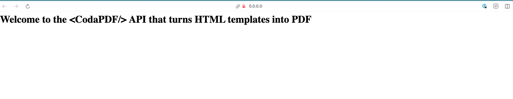
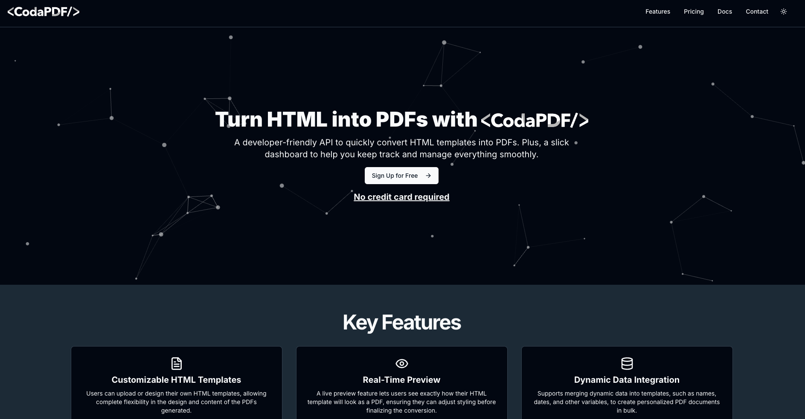

## Welcome to \<CodaPDF />

This project is a simple web application that allows users to convert a web page to a PDF file. The project is divided into two main parts:

* [app.codapdf.com](./app.codapdf.com) -  The NextJs web application that allows users to sign up, log in, and convert HTML to PDF files. It is built with Next.js. 

* [services.codapdf.com](./services.codapdf.com) - The Python app that handles the conversion of web pages to PDF files. It is built with FastAPI and uses the [playwright](https://pypi.org/project/playwright/1.48.0/) library to convert the HTML to PDF files.

### Running the project locally

#### Requirements

* Docker
* Docker-compose
* Python 3.8 or higher
* Node.js 14 or higher
* Bun 2.0 or higher

The apps has its own environment variables and to make it easy to start the project locally, there is `.env.example` file for each app directory. To use the environment variables, copy the `.env.example` file to `.env` and fill in the values. Then, go to the root of the repo abd run the docker-compose command to start the services. The [`docker-compose`](./docker-compose.yaml) will build the images and start the services like:

* Postgres
* Redis
* Storage service 

### Running services.codapdf.com
```bash
# Make sure you are in the root directory of the project before running the following commands

# Change to the services.codapdf.com directory
cd apps/services.codapdf.com 
# Create a virtual environment
python3 -m venv .venv 
# Activate the virtual environment
source .venv/bin/activate 
# Install the dependencies
pip install -r requirements.txt 

# Start the services.codapdf.com app
PYTHONPATH=./src uvicorn src.app:app --reload --port 5000 

```
If everything goes well, you should be able to access the services.codapdf.com app at `http://0.0.0.0:5000` in your browser:



### Running app.codapdf.com
```bash
# Make sure you are in the root directory of the project before running the following commands

cd apps/app.codapdf.com
# Install the dependencies
bun install

# Migrate the database
bun run migration:run

# Start the app.codapdf.com app
bun run dev
```

If everything goes well, you should be able to access the app.codapdf.com app at `http://localhost:3000` in your browser.


